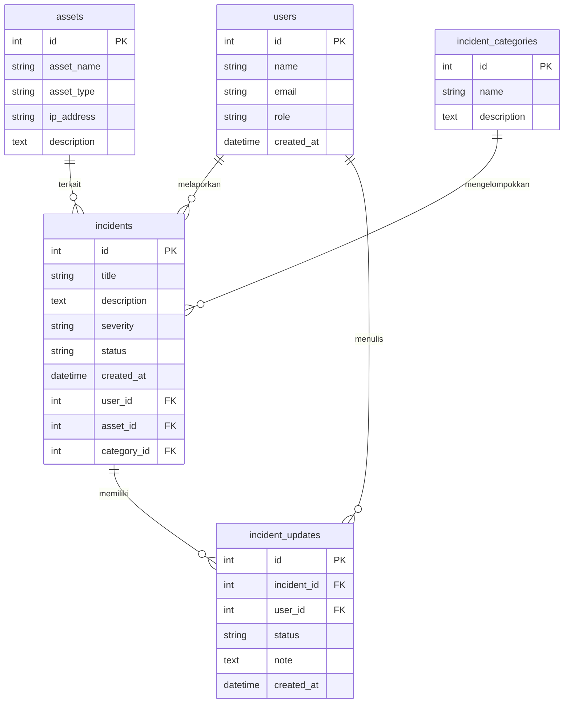

# ERD CyberIncident API

Diagram ini menunjukkan hubungan lima tabel pada database CyberIncident API.

```mermaid
erDiagram
    users ||--o{ incidents : melaporkan
    assets ||--o{ incidents : terkait
    incident_categories ||--o{ incidents : mengelompokkan
    incidents ||--o{ incident_updates : memiliki
    users ||--o{ incident_updates : menulis

    users {
        int id PK
        string name
        string email
        string role
        datetime created_at
    }

    assets {
        int id PK
        string asset_name
        string asset_type
        string ip_address
        text description
    }

    incident_categories {
        int id PK
        string name
        text description
    }

    incidents {
        int id PK
        string title
        text description
        string severity
        string status
        datetime created_at
        int user_id FK
        int asset_id FK
        int category_id FK
    }

    incident_updates {
        int id PK
        int incident_id FK
        int user_id FK
        string status
        text note
        datetime created_at
    }
```
